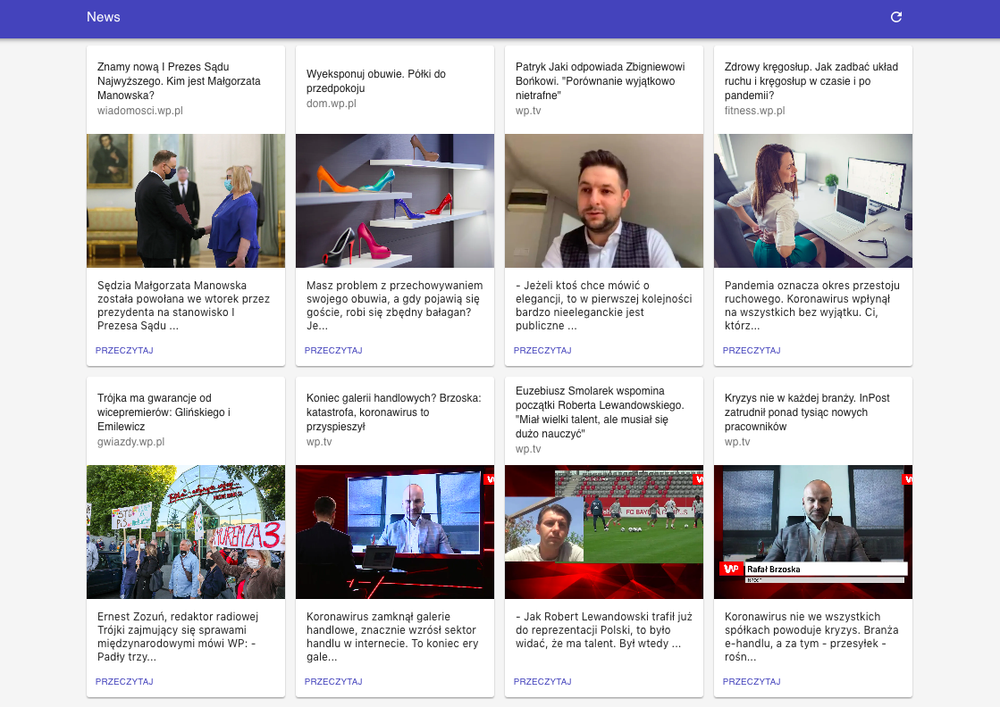

# news app 📰

An app which helps you explore the latest news.

This project was bootstrapped with [Create React App](https://github.com/facebook/create-react-app).

## Table of Contents

- General info
- Setup
- Available scripts
- Technologies

### General info

Project is a simple app for people who want to explore the latest news. You can see list of the news and click for more detailed article.

## Setup

### 1. Set up env variables

- Create `.env` file in the project root.
- Copy content of the `.env.sample` template into it.
- Set the `REACT_APP_API_ENDPOINT` value to wpmobile.pl GraphQL API endpoint.

### 2. `yarn`

Install all dependencies.
In the project directory, you can run `yarn`.

### 3. `yarn start`

Then you can run the app in the development mode with `yarn start`. 
Open [http://localhost:3000](http://localhost:3000) to view it in the browser.

## Available Scripts

### `yarn test`

Launches the test runner in the interactive watch mode. 
See the section about [running tests](https://facebook.github.io/create-react-app/docs/running-tests) for more information.

### `yarn build`

Builds the app for production to the `build` folder. 
It correctly bundles React in production mode and optimizes the build for the best performance.

The build is minified and the filenames include the hashes. 
Your app is ready to be deployed!

See the section about [deployment](https://facebook.github.io/create-react-app/docs/deployment) for more information.

## Technologies

- ReactJS / ES6
- Apollo GraphQL
- React Testing Library / Jest
- Material UI
- HTML5
